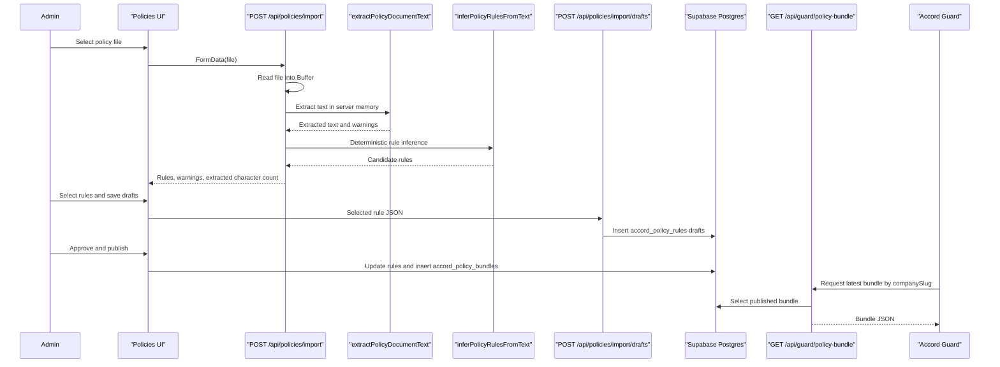
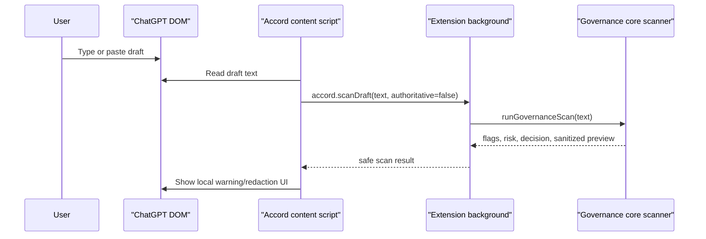
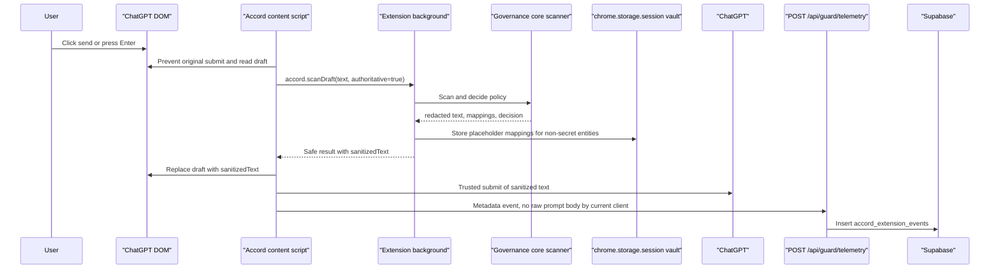
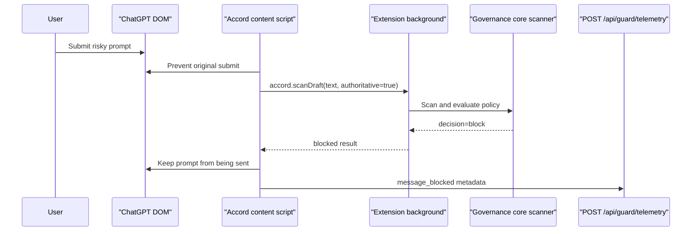
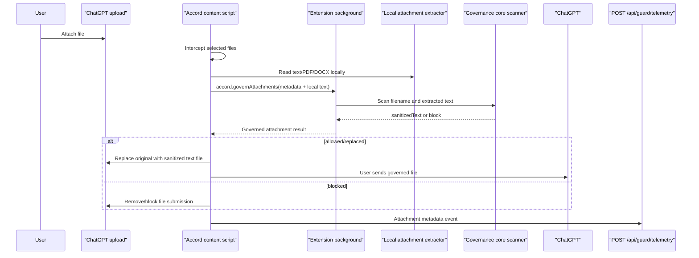
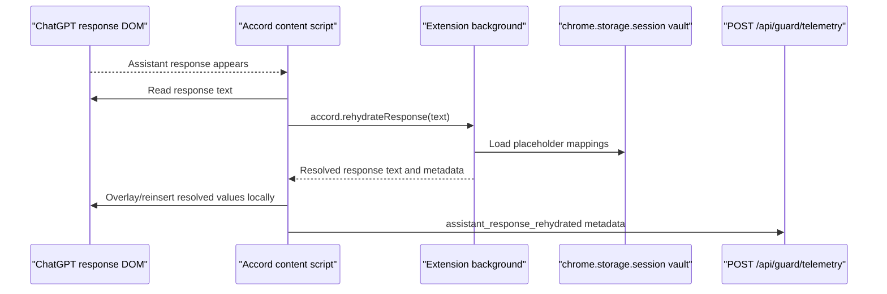
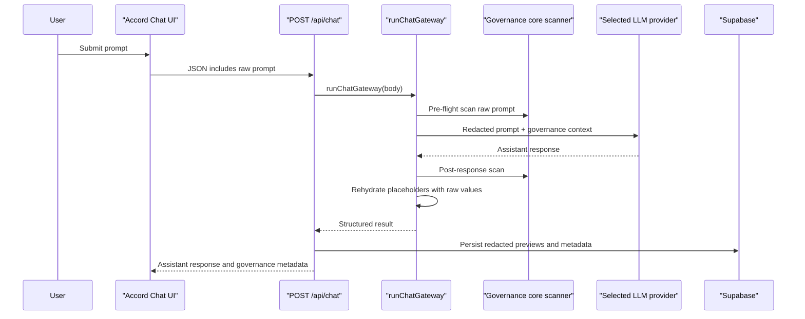

# Accord Data Flow Audit

Audit date: 2026-08-06

Scope: read-only inspection of repository code. This document separates the implemented data flows from intended product direction.

## Policy-Document Flow

### Direct Answers

1. Where is the document selected?
   - In the admin Policies page import panel. Evidence: `src/app/(app)/policies/policy-import-panel.tsx:27-40`.

2. Is the entire file read in the browser?
   - The browser hands the selected `File` to `FormData` and posts it to the backend. The file object is read for upload by browser networking, not parsed locally in this admin flow. Evidence: `src/app/(app)/policies/policy-import-panel.tsx:36-40`.

3. Is it sent to the Accord backend?
   - Yes. The form is posted to `/api/policies/import`. Evidence: `src/app/(app)/policies/policy-import-panel.tsx:36-40`, `src/app/api/policies/import/route.ts:10-23`.

4. Is it sent directly from the browser to a third-party provider?
   - No direct third-party upload was found in this flow.

5. Is it stored in object storage, a database, browser storage, or memory?
   - The original uploaded file is read into server memory with `Buffer.from(await file.arrayBuffer())`. No object-storage write was found. Candidate rules are kept in React state until saved. Evidence: `src/app/api/policies/import/route.ts:23`, `src/app/(app)/policies/policy-import-panel.tsx:49-50`.

6. Is the original document retained?
   - No retained original policy document was found in repository code.

7. Is extracted text retained?
   - The full extracted text is not stored by the visible import route. Generated rules can store source excerpts in `supporting_excerpt`. Evidence: `src/app/api/policies/import/route.ts:40-48`, `supabase/migrations/20260728100000_create_policy_enforcement_loop.sql:69-99`.

8. Is the document or extracted text sent to an AI model?
   - No. The route uses deterministic `inferPolicyRulesFromText`, not a model provider. Evidence: `src/app/api/policies/import/route.ts:40`, `src/lib/policy-import/rule-inference.ts:48`.

9. Which provider, model, endpoint, and SDK are used?
   - None for policy import.

10. Is the model name hardcoded or configurable?
   - Not applicable to policy import.

11. What system prompt and data are sent to the model?
   - None in current policy import flow.

12. What does the model return?
   - None. The deterministic parser returns candidate rule objects and warnings.

13. How are proposed rules represented?
   - As structured imported rule drafts with name, rule key, source policy name, source section, supporting excerpt, categories, scope, provider, destination type, action, fallback action, severity, explanation, and effective date. Evidence: `src/lib/policy-import/rule-inference.ts:168-259`.

14. Does an administrator review the rules?
   - Yes, in the Policies UI. Imported rules are selectable and saved as drafts, then separately approved/published. Evidence: `src/app/(app)/policies/policy-import-panel.tsx:49-78`, `src/app/(app)/policies/page.tsx:113-161`.

15. Are rules actually published and distributed?
   - Yes, with limitations. Approved active rules are packaged into `accord_policy_bundles`, and the extension fetches the latest published bundle. Evidence: `src/lib/db/accord-store.ts:665-754`, `src/app/api/guard/policy-bundle/route.ts:6-22`, `extension/src/policy/bundle-client.ts:15-43`.

16. Can rules be traced back to the source policy clause?
   - Partially. Rules can store `source_policy_name`, `source_section`, and `supporting_excerpt`. Events do not always include rule identifiers or source clause metadata. Evidence: `supabase/migrations/20260728100000_create_policy_enforcement_loop.sql:69-99`, `extension/entrypoints/accord.content/index.tsx:598-615`.

17. What happens when the source policy changes?
   - No source-document versioning/update flow was found. An admin can upload another document and create more rules.

18. Are old policy versions retained?
   - Yes for rules/bundles. Rules have versions; bundles are inserted with increasing versions and prior bundles are superseded. Evidence: `src/lib/db/accord-store.ts:541-754`.

19. Can a policy or version be deleted?
   - Individual policy rules can be deleted after archival. No full policy-document delete/version delete was found. Evidence: `src/lib/db/accord-store.ts:652-662`.

20. Are policy contents exposed through logs, errors, analytics, or monitoring?
   - No explicit logging of full policy text was found. However, `supporting_excerpt` is stored in policy rules, and route/server/platform logs outside the repo may capture errors or request metadata. Infrastructure logs require external inspection.

### Actual Policy Flow Diagram

## Employee-Prompt Flow

### Path A: Typing and Pasting in ChatGPT

1. DOM content read:
   - The content script reads draft text through the ChatGPT adapter. Evidence: `extension/entrypoints/accord.content/index.tsx:107-153`.
2. Continuous or submission-only:
   - Debounced live reading while the draft changes, plus authoritative scan on submit. Evidence: `extension/entrypoints/accord.content/index.tsx:107-153`, `:173-233`.
3. Held in JavaScript memory:
   - Yes, as local variables and scan payloads.
4. Written to browser storage:
   - Live non-authoritative scans do not intentionally write raw prompt to storage. Authoritative scans may write placeholder mappings, excluding secrets, to `chrome.storage.session`. Evidence: `extension/src/governance/placeholder-vault.ts:24-44`, `:88-100`.
5. Detectors:
   - Deterministic regex/heuristics for email, phone, secrets, regulated context, prompt injection, account/address/name patterns. Evidence: `packages/governance-core/src/scanner.ts:53-88`, `:658-691`, `:964-979`.
6. Local ML/model:
   - No local model execution confirmed.
7. Backend/model transmission:
   - The live draft scan is sent to the extension background, not to Accord backend or provider.

### Path B: Submit Allowed or Redacted Prompt

1. DOM content read:
   - Final draft text is read on submit. Evidence: `extension/entrypoints/accord.content/index.tsx:173-180`.
2. AI provider call order:
   - The extension prevents the original submit, scans locally, replaces the composer if redaction is required, then performs trusted submit. Evidence: `extension/entrypoints/accord.content/index.tsx:173-247`.
3. Raw prompt leaving browser:
   - Repository code does not send raw prompt to Accord backend or OpenAI. Caveat: the raw prompt exists in the ChatGPT page DOM before Accord submits redacted content.
4. Redacted prompt leaving browser:
   - Yes, if redaction occurs. The redacted prompt is submitted to ChatGPT.
5. Metadata leaving browser:
   - Yes. Telemetry metadata is sent to Accord backend. Evidence: `extension/entrypoints/accord.content/index.tsx:265-283`, `extension/src/telemetry/client.ts:18-35`.

### Path C: Blocked Prompt

If the scanner or active policy decides `block`, the extension prevents submit and sends a metadata event.

### Path D: Uploading a File in ChatGPT

Supported text/PDF/DOCX-like files are read locally by the extension. If governance allows a sanitized replacement, the original file is replaced with a generated text file containing governed content.

Evidence:

- File payload creation: `extension/entrypoints/accord.content/index.tsx:485-528`.
- Attachment governance call: `extension/entrypoints/accord.content/index.tsx:306-371`.
- Local extraction: `extension/src/attachments/extract-text.ts:26-48`.
- Attachment governance: `extension/src/governance/scan-session.ts:127-347`.

### Path E: Assistant Response Rehydration

The extension reads the assistant response DOM and restores placeholders locally using the session vault. It reports metadata if rehydration occurs.

Evidence: `extension/entrypoints/accord.content/index.tsx:402-442`, `extension/src/governance/scan-session.ts:101-120`.

## Accord Web Chat Flow

The in-app Accord Chat page is different from the extension:

- Raw prompt is collected in React state and posted to `/api/chat`. Evidence: `src/app/(app)/chat/chat-workspace.tsx:337-391`, `src/app/(app)/chat/chat-workspace.tsx:112-122`.
- The route parses JSON and runs the chat gateway. Evidence: `src/app/api/chat/route.ts:36-40`.
- The gateway scans the raw prompt server-side. Evidence: `src/lib/chat/gateway.ts:37`.
- Provider context uses redacted prompt and sanitized history. Evidence: `src/lib/chat/context-builder.ts:47-54`, `src/lib/chat/context-builder.ts:106-114`.
- Assistant output is post-scanned and rehydrated with raw values server-side before returning to the browser. Evidence: `src/lib/chat/gateway.ts:126-129`.
- Chat persistence stores redacted previews and metadata, with `raw_stored:false`. Evidence: `src/lib/db/accord-store.ts:313-368`.

## AI Model Calls

| File / Function | Trigger | Provider | Model | Endpoint | Data Sent | Raw Employee Content Included? | Policy Document Content Included? | Output | Storage | Timeout / Retry | Failure Behavior | Logging |
|---|---|---|---|---|---|---|---|---|---|---|---|---|
| `src/lib/chat/providers/openai-provider.ts` / `OpenAIProvider.generate` | Accord web chat `/api/chat` after preflight | OpenAI | `OPENAI_MODEL` or registry API model | `https://api.openai.com/v1/chat/completions` | Provider messages built from redacted prompt, sanitized history, governance context | Not intentionally; detector misses could pass through | No | Assistant text | Redacted preview persisted by chat gateway; provider output returned | No explicit timeout/retry found | Throws provider error/falls to route error handling | No explicit body logging found |
| `src/lib/chat/providers/anthropic-provider.ts` / `AnthropicProvider.generate` | Accord web chat if selected | Anthropic | `ANTHROPIC_MODEL` or registry API model | `https://api.anthropic.com/v1/messages` | System prompt and sanitized messages | Not intentionally | No | Assistant text | Same as above | No explicit timeout/retry found | Throws provider unavailable/error | No explicit body logging found |
| `src/lib/chat/providers/gemini-provider.ts` / `GeminiProvider.generate` | Accord web chat if selected | Google Gemini | `GEMINI_MODEL` or registry API model | `https://generativelanguage.googleapis.com/v1beta/models/...:generateContent` | System instruction and sanitized contents | Not intentionally | No | Assistant text | Same as above | No explicit timeout/retry found | Throws provider unavailable/error | No explicit body logging found |
| `src/lib/chat/providers/mock-provider.ts` | Missing provider/API key or internal mock | Local mock | `mock-governed-chat` | None | Redacted/governance context | No network | No | Mock response | Redacted preview if chat persisted | N/A | N/A | N/A |

No AI model call was found in policy import. No local model execution was confirmed in the extension.

## Data Inventory

| Data Category | Origin | Local Processing | Browser Storage | Sent to Accord Backend | Sent to Third Party | Third Party | Database / Storage Destination | Retention Behavior | Deletion Mechanism | Encryption Visible | Log Exposure | Purpose | References | Confidence |
|---|---|---|---|---|---|---|---|---|---|---|---|---|---|---|
| Raw employee prompt | ChatGPT DOM or Accord web chat input | Extension scans locally; web chat scans server-side | Extension: transient memory; placeholders only in session storage after redaction | Extension: no raw prompt by current client; Web chat: yes to `/api/chat` | Extension: redacted prompt to ChatGPT; Web: redacted context to model | ChatGPT, configured web provider | Not stored as raw by visible DB code | Memory/request lifetime; platform logs unknown | None visible | None beyond platform defaults | Possible server/platform request logs unknown | Governance scan | `extension/entrypoints/accord.content/index.tsx:173-233`, `src/app/api/chat/route.ts:36-40` | Confirmed |
| Redacted prompt | Scanner output | Local/server redaction | May be in DOM/composer; no long-term extension storage except placeholders | Web chat persists redacted preview | Yes, extension submits redacted text to ChatGPT; web provider receives redacted context | ChatGPT/OpenAI/Anthropic/Gemini depending path | `redacted_preview` columns, extension event metadata counts | No retention policy found | No deletion path for events found | None visible | Could appear in server logs if errors include response payload | Safe model input/evidence | `packages/governance-core/src/scanner.ts:431-456`, `src/lib/db/accord-store.ts:313-368` | Confirmed |
| AI-tool response | ChatGPT DOM or web provider response | Extension rehydrates locally; web post-scans server-side | Extension: response text in memory only | Extension: no response body, metadata only; Web: provider response reaches backend | Web provider generated it; ChatGPT generated response in browser path | ChatGPT/OpenAI/Anthropic/Gemini | Web chat redacted assistant preview in `accord_chat_messages` | No retention policy found | No deletion path found | None visible | Platform logs unknown | Assistant output and audit evidence | `extension/entrypoints/accord.content/index.tsx:402-442`, `src/lib/chat/gateway.ts:126-129` | Confirmed |
| Uploaded employee file | ChatGPT upload or Accord web chat upload | Extension extracts supported text locally; web attachment API reads on backend | Extension: transient memory; possible placeholder vault | Extension: metadata only; Web: file sent to `/api/attachments` | Extension: sanitized replacement to ChatGPT; Web images may route to selected model | ChatGPT/model provider | No original file storage found | Memory/request lifetime | None visible | None visible | Console logs support metadata, not content | Govern attachments | `extension/entrypoints/accord.content/index.tsx:485-528`, `src/app/api/attachments/route.ts:18-119` | Confirmed |
| Extracted employee-file text | Local extension extractor or web backend extractor | Scanned/redacted | Extension: no full raw text storage found | Extension: no raw text; Web: yes for upload API | Sanitized text may go to ChatGPT/model | ChatGPT/model provider | Not stored raw by visible code | Memory/session mapping only | Browser session end for vault | None visible | Error logs unknown | Attachment governance | `extension/src/attachments/extract-text.ts:26-48`, `extension/src/governance/scan-session.ts:247-337` | Confirmed |
| Original company policy document | Admin upload | Parsed server-side | Browser file object/transit only | Yes, `/api/policies/import` | No AI/third-party call found | None | No object storage or DB original found | Request memory only | None needed/visible | None visible | Platform logs unknown | Rule extraction | `src/app/api/policies/import/route.ts:10-23` | Confirmed |
| Extracted policy text | Server-side extractor | Deterministic inference | None | Already on backend | No AI call found | None | Full text not stored; excerpts stored in rules | Excerpts persist with rules | Rule archive/delete only | None visible | Error logs unknown | Source evidence for rules | `src/lib/policy-import/document-text.ts:16-82`, `src/lib/policy-import/rule-inference.ts:168` | Confirmed |
| Generated policy rules | Policy import or admin form | Server validation and formatting | React state before save | Yes | No | None | `accord_policy_rules`, `accord_policy_bundles` | Persist until archive/delete/supersede | Delete archived rule only | Supabase defaults only | DB logs unknown | Enforcement | `src/lib/db/accord-store.ts:541-754` | Confirmed |
| Policy versions | Admin actions | Server assigns versions | None | Yes | No | None | `accord_policy_rules.version`, `accord_policy_bundles.version` | Old versions retained/superseded | Limited rule delete | Supabase defaults only | DB logs unknown | Audit/versioning | `src/lib/db/accord-store.ts:665-754` | Confirmed |
| User identity | Supabase Auth or extension install | Auth/session lookup | Extension install ID in local storage | Yes for dashboard/auth and telemetry | Supabase Auth/OAuth | Supabase, OAuth provider | `auth.users`, `accord_company_members`, `accord_extension_users` | No deletion path found | Supabase/account deletion external | Supabase defaults | Auth logs external | Tenant/user attribution | `src/lib/auth/organization.ts:27-74`, `extension/src/telemetry/client.ts:63-85` | Confirmed |
| Employee email | Supabase auth profile | Organization creation | Not extension default | Yes if authenticated | Supabase/OAuth | Supabase/OAuth provider | `auth.users`, company membership metadata possibly | No app deletion found | Supabase external | Supabase defaults | Auth logs external | Account identity | `src/lib/auth/organization.ts:137-153` | Likely |
| Organization membership | Auth onboarding | Server lookup/upsert | None | Yes | Supabase | Supabase | `accord_company_members` | Persistent | No UI found | Supabase defaults | DB logs external | Tenant isolation | `supabase/migrations/20260803120000_add_auth_organizations.sql:10-22` | Confirmed |
| Team or department | Admin/extension schema | Minimal | None confirmed | Maybe in extension user records | No | None | `accord_extension_users.department`, policy rule department scope | Persistent | No UI found | Supabase defaults | DB logs external | Scoped policy | Migrations and `src/lib/db/accord-store.ts` | Likely |
| Browser-extension token | None found | N/A | No auth token found | N/A | N/A | N/A | Absent | N/A | N/A | N/A | N/A | Intended auth | Search result: absent | Confirmed absent |
| Policy event | Scanner/policy outcome | Metadata construction | None long-term | Yes | Supabase | Supabase | `accord_extension_events`, `accord_governance_events` | Persistent | No event delete found | Supabase defaults | DB/platform logs | Dashboard/audit | `src/lib/db/accord-store.ts:389-469` | Confirmed |
| Risk classification | Scanner result | Local/server | None | Metadata only | No | None | Event rows | Persistent | No delete found | Supabase defaults | Logs unknown | Analytics | `packages/governance-core/src/scanner.ts:607-654` | Confirmed |
| Rule triggered | Policy evaluator | Local extension | None | Metadata only | No | None | Extension event columns `rule_*` | Persistent | No delete found | Supabase defaults | Logs unknown | Traceability | `extension/entrypoints/accord.content/index.tsx:598-615` | Confirmed |
| Destination AI tool | Extension adapter/model context | Local | Local settings | Metadata | ChatGPT/model provider by workflow | ChatGPT/OpenAI/etc | `surface`, `ai_provider` | Persistent | No delete found | Supabase defaults | Logs unknown | Reporting | `extension/src/adapters/types.ts:3`, `src/lib/db/accord-store.ts:1584` | Confirmed |
| Timestamp | Client/server clock | Server inserts | None | Yes | Supabase | Supabase | `created_at`, `occurredAt` metadata | Persistent | No delete found | Supabase defaults | Logs external | Audit sequence | Migrations | Confirmed |
| Override decision | User action | Not found | Not found | Not found | Not found | None | Absent | N/A | N/A | N/A | N/A | Future approval/override | No override path found | Confirmed absent |
| Analytics event | Extension telemetry | Metadata only | None | Yes | Supabase | Supabase | `accord_extension_events` | Persistent | No delete found | Supabase defaults | Logs external | Metrics | `extension/src/telemetry/client.ts:18-35` | Confirmed |
| Error report | Extension/server catch blocks | Error messages | None | Extension may send `extension_error` metadata | Supabase | Supabase | `accord_extension_events.metadata` | Persistent | No delete found | None visible | Could include error string; current client tries not to include raw content | Diagnostics | `extension/entrypoints/accord.content/index.tsx:288-302`, `src/lib/db/accord-store.ts:389-469` | Likely |
| IP / request metadata | Network/platform | Platform-level | N/A | Yes, inherently to servers | Vercel/Supabase | Vercel/Supabase | Not stored by app code | Platform-specific | External settings | Provider defaults | Hosting/provider logs | Security/operations | Requires infra inspection | Uncertain |

## Server Storage and Database Audit

### Tables

| Table | Stores | Raw Prompt / Response? | Raw Uploaded File? | Policy Content? | Read/Write Path |
|---|---|---|---|---|---|
| `accord_workspace_memory` | Seeded product memory/context | No employee prompts | No | Product/product principle text | Migration seed; dashboard reads |
| `accord_chat_sessions` | Web chat session metadata | No full prompt | No | No | `persistChatGatewayRun` |
| `accord_chat_messages` | Web chat message role, redacted preview, raw_stored flag | Redacted previews only by current code; `raw_stored:false` | No | No | `src/lib/db/accord-store.ts:313-340` |
| `accord_governance_events` | Web chat policy decisions and redacted previews | Redacted prompt preview by current code | No | No | `src/lib/db/accord-store.ts:345-368` |
| `accord_audit_events` | Audit event messages and metadata | No raw content by current inserted messages | No | No | `src/lib/db/accord-store.ts:371-380` |
| `accord_companies` | Organizations | No | No | No | Migrations, auth/org functions |
| `accord_extension_users` | Extension install/user metadata | No | No | No | `recordExtensionTelemetryEvent` |
| `accord_extension_events` | Extension telemetry metadata, risk, counts, rule info | No raw prompt by current extension client | No | No | `src/lib/db/accord-store.ts:440-469` |
| `accord_policy_rules` | Draft/approved/archived rules | No employee prompts | No | Source policy excerpts and generated rule text | `src/lib/db/accord-store.ts:541-650` |
| `accord_policy_bundles` | Published policy bundle JSON/checksum | No employee prompts | No | Generated rules/source metadata | `src/lib/db/accord-store.ts:665-754` |
| `accord_company_members` | Authenticated account memberships | No | No | No | `src/lib/auth/organization.ts` |

### Generic Columns With Content Risk

Columns that deserve careful handling:

- `metadata` in `accord_governance_events`, `accord_audit_events`, and `accord_extension_events`.
- `redacted_preview` in chat/governance tables.
- `message` in `accord_audit_events`.
- `supporting_excerpt` and `employee_explanation` in `accord_policy_rules`.
- `bundle` JSON in `accord_policy_bundles`.

Current code appears to avoid raw prompt storage in these fields, but generic JSON/text columns can accidentally hold raw content if a future client sends it.

### RLS and Access Control

RLS is enabled in migrations for several tables:

- Initial governance tables: `supabase/migrations/20260727143000_create_accord_governance_store.sql:72-76`.
- Extension telemetry: `supabase/migrations/20260727152000_create_extension_telemetry.sql:59-61`.
- Policy tables: `supabase/migrations/20260728100000_create_policy_enforcement_loop.sql:120-121`.
- Company members: `supabase/migrations/20260803120000_add_auth_organizations.sql:53`.

However, the application frequently uses Supabase service role credentials server-side, which bypasses RLS. Evidence: `src/lib/db/accord-store.ts:780-798`. The guard APIs also lack request authentication in visible code.

No Supabase Storage buckets were found in migrations.

## Local Storage Audit

| Mechanism | Keys | Data Shape | Raw Sensitive Values? | Persistence | Deletion | Encryption Visible | Access Scope |
|---|---|---|---|---|---|---|---|
| `chrome.storage.session` | `accord.guard.vault.${surface}.${conversationKey...}` | Placeholder vault mapping placeholders to original entity values, excluding secrets | Yes, for non-secret values needed for rehydration | Session lifetime; not intended across browser restart | Cleared by session end or overwritten; no explicit user delete found | No | Extension contexts |
| `chrome.storage.session` | `accord.guard.vault.${surface}.recentDraft` | Recent placeholder mapping fallback | Yes, non-secret values; max age 10 minutes | Session lifetime | Age-gated in code | No | Extension contexts |
| `chrome.storage.local` | `accordGuardInstallId` | Random install ID | No prompt content | Persists across restarts | No explicit UI delete found | No | Extension contexts |
| `chrome.storage.local` | `accordApiBaseUrl` | Accord API base URL | No | Persists | No explicit UI delete found | No | Extension contexts |
| `chrome.storage.local` | `accordCompanySlug`, `accordCompanyName`, `accordUserLabel` | Tenant/user display settings | No raw prompt | Persists | No explicit UI delete found | No | Extension contexts |
| `chrome.storage.local` | `accordPolicyBundle:${companySlug}` | Cached policy bundle JSON | Policy rules/source metadata | Persists until overwritten/cache TTL logic | No explicit delete found | No | Extension contexts |
| In-memory maps | `extension/src/policy/bundle-client.ts:9-13` | Short-lived bundle cache | No prompt content | Runtime only | Page/service worker lifecycle | No | Extension runtime |

No `localStorage`, `sessionStorage`, IndexedDB, cookies, or Cache API usage for prompt data was confirmed in extension code.

## Network and Third-Party Audit

| Host / Endpoint | Purpose | Calling Component | Data Sent | Auth Method | Employee/Policy Content? | Required? |
|---|---|---|---|---|---|---|
| `https://chatgpt.com/*` | Supported AI surface | Extension content script | Redacted prompt and sanitized replacement files via page UI | User's ChatGPT session | Redacted employee content; raw may exist in DOM before submission | Core extension demo |
| `/api/guard/telemetry` on Accord API base | Store extension telemetry | Extension telemetry client | Metadata: counts, risk, flags, rule IDs, action, length buckets | None visible | No raw prompt by current client | Core dashboard metrics |
| `/api/guard/policy-bundle` on Accord API base | Fetch published rules | Extension bundle client | Company slug query | None visible | Policy bundle/rule metadata | Core policy enforcement |
| `/api/chat` | Web chat gateway | Accord Chat UI | Raw prompt, history, attachments | App session not clearly enforced | Raw prompt to Accord backend | Web chat feature |
| `/api/attachments` | Web chat attachment processing | Accord Chat UI | Uploaded file | App session not clearly enforced | Uploaded file content | Web chat feature |
| `/api/policies/import` | Policy document import | Admin UI | Original policy file | Dashboard route/session weakly enforced | Policy document content | Policy authoring |
| Supabase URL from env | Database/Auth | Server routes, auth helpers | DB queries/auth payloads | Service role/server client or public auth client | Metadata, redacted previews, policy rules | Core persistence |
| `https://api.openai.com/v1/chat/completions` | Web chat model provider | OpenAI provider | Sanitized/redacted chat context | `OPENAI_API_KEY` | Redacted employee prompt/history; false negatives possible | Optional |
| `https://api.anthropic.com/v1/messages` | Web chat model provider | Anthropic provider | Sanitized/redacted chat context | `ANTHROPIC_API_KEY` | Redacted employee prompt/history; false negatives possible | Optional |
| `https://generativelanguage.googleapis.com/v1beta/models/...` | Web chat model provider | Gemini provider | Sanitized/redacted chat context | Gemini/Google API key | Redacted employee prompt/history; false negatives possible | Optional |
| Supabase OAuth provider routes | Login with Google/GitHub | Auth route | OAuth login state | Supabase Auth | User identity | Optional/auth |

No third-party analytics, Sentry, queue service, feature flag service, email provider, or payment provider was confirmed in repository code.

